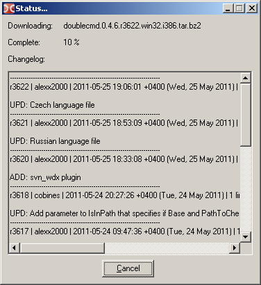
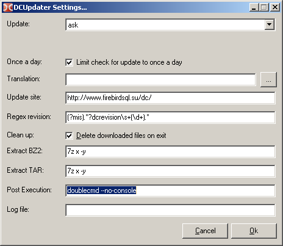

DCUpdater is a simple script for updating Double Commander to current snapshot.

Features:

* Downloads and extracts the latest snapshot of Double Commander before launch
* Support for translation
* Settings

